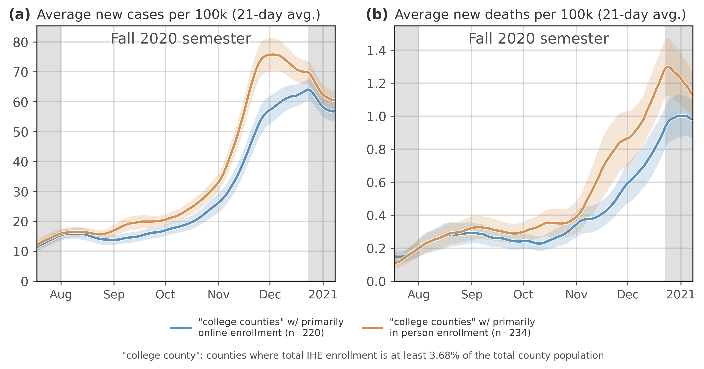

# Campus COVID Data
Institutes of higher education (IHEs) can play a large role in mitigating the spread of COVD-19, and this is especially true as we await large scale vaccination. There is not a national repository for recording the amount of testing and case counts for individuals affiliated with universities, and as such, many administrators and local policymakers are not equipped with the most up-to-date data to inform their decision-making. This dataset is designed to be a stopgap to this problem---a holdover until nationwide or statewide policies are enacted to more systematically collect this data.

In creating this dataset, I relied on IHEs' "COVID Dashboards", which vary in their sophistication and informativeness, but more often than not, they report the number of student/faculty/staff cases affiliated with the IHE. If a college or university has put in place a regular testing protocol, they often report the daily or weekly number of tests that have been conducted as well. These data help us piece together an ever-incomplete picture of the impact / role that IHEs have on the broader community and taken together should inform decision-making at the local and institutional levels (i.e. whether to allow students back for in-person classes, hybrid classes, online only, etc.).

In order to collect this data, I first collected the urls of thousands of IHEs' COVID Dashboards. I did this with a Python package that uses the [Google Search API](https://pypi.org/project/gsearch/). Using data from IPEDS (i.e. institution name, state, etc.), I automated several Google searches for each IHE that included the IHE's name along with keywords like "covid cases" and "covid dashboard" and "covid testing" etc. I aggregated these urls into a single dataframe, which I then used to pre-populate thousands of individual Google Sheets, one per IHE. This streamlined the data collection process, since all you need to do to collect data is click on the url for the Google Sheet of the IHE, click on the its dashboard url, and start copying the data into the sheet.

To my knowledge, this has turned into the largest dataset with time series of campus COVID cases and testing in the United States. That said, **this is not meant to replace or stand-in for expert knowledge about how to enact policy.** I hope it inspires policymakers to assemble a national database for this information, one that institutions of higher education are required to report to. This is already done in several states. In the meantime, I encourage folks to check this one out, contribute to it, and share it widely.


## Limitations
There are several. First---because this dataset was formed to address the lack of nationwide (or in most cases, statewide) standards that compel institutes of higher education to report their testing and case count data---much of these data were gathered through a huge crowdsourcing effort (survey link [here](https://neu.co1.qualtrics.com/jfe/form/SV_8dE7jqvikKSlgYR)). As such, there is very likely human error in the collection or reporting of data. Second, many schools rely on self-reported data, which can also present an opportunity for human error. Third, as time goes on, IHEs may update their own counts of testing and cases, which might produce inconsistencies with the data used here. Fourth, assigning any sort of causation to these measures is very tricky and all of the preliminary results below should be interpreted as associations or correlations.


## Notebooks
1. [Automate the creation of individual Google Sheets](https://github.com/jkbren/campus-covid/blob/main/code/create_google_sheets.ipynb)
2. [Pull data from Google Sheets](https://github.com/jkbren/campus-covid/blob/main/code/retrieve_data_from_google_sheets.ipynb)
3. [Campus COVID dataset map](https://github.com/jkbren/campus-covid/blob/main/code/campus-covid_map.ipynb)
4. [Set up matching procedure](https://github.com/jkbren/campus-covid/blob/main/code/matching-jsd_minimization.ipynb)
5. [Main figures](https://github.com/jkbren/campus-covid/blob/main/code/main-figures.ipynb)
6. [Massachusetts analysis](https://github.com/jkbren/campus-covid/blob/main/code/analysis-massachusetts.ipynb)
7. [Case study: UMass Amherst](https://github.com/jkbren/campus-covid/blob/main/code/case-study-umass.ipynb)
8. [Statistical controls - negative binomial regression](https://github.com/jkbren/campus-covid/blob/main/code/regression-negativebinomial.ipynb)
9. [Misc: Pull county tesing data from CDC](https://github.com/jkbren/campus-covid/blob/main/code/county-level-diagnostic-testing-volume-cdc.ipynb)
10. [Misc: NYT case count data](https://github.com/jkbren/campus-covid/blob/main/code/nyt-college-data.ipynb)

## Other datasets
1. nyt_cases_as_of_12-11.csv - New York Times case counts (https://www.nytimes.com/interactive/2020/us/covid-college-cases-tracker.html)
2. party_school_rankings.tsv - party school ranking data scaped from niche.com (https://www.niche.com/colleges/search/top-party-schools/)
3. ipeds_data.csv - IPEDS school data (https://nces.ed.gov/ipeds/use-the-data)
4. local policy data - COVID-Local (https://www.covid-local.org/amp/)


### Main packages used  <a name="requirements"/>

This code is written in [Python 3.x](https://www.python.org) and uses the following packages:

* [Pandas](https://pandas.pydata.org/)
* [Numpy](http://numpy.scipy.org/)
* [geopandas](https://geopandas.org/) (for replicating the map figures)
* [gspread](https://gspread.readthedocs.io/en/latest/) 


## Data and findings
To download the csv of the full dataset, see data folder. This dataset was built by heavily relying on a Python to Google sheets interface. I learned about this tool [here](https://www.twilio.com/blog/2017/02/an-easy-way-to-read-and-write-to-a-google-spreadsheet-in-python.html). To recreate the dataset entirely, you will need to go through the steps to enable API acccess [here](https://gspread.readthedocs.io/en/latest/oauth2.html#enable-api-access).

State-by-state Google sheets (with separate tabs for each school) and a [Reference](https://docs.google.com/spreadsheets/d/1GMu4fful47nUIFlwl293cPqPGG0XX3uIl0zno-bTJbY/edit?usp=sharing) Google sheet can be found in this drive [here](https://drive.google.com/drive/folders/19MLhkjQl3qhlGSmwD2MVbqOE_7ZaID0j?usp=sharing).

The main finding of this work so far concerns campus testing from IHEs. 

- - - -

<p align="center">

</p>

**<p align="center">Current status of the Campus Covid dataset.**

- - - -

<p align="center">

</p>

**<p align="center">Counties with IHEs with primarily in-person vs. primarily online Fall 2020.**

- - - -

## Citation
If you use this data or would like to cite this work:

Bibtex: 
```text
@article{Klein2021campus,
    title = {{Higher education responses to COVID-19 in the United States: Evidence for the impacts of university policy}},
    author = {Klein, Brennan and Generous, Nicholas and McCabe, Stefan and Bhadricha, Zarana and Gunashekar, Rishab and Kori, Preeti and Li, Bodian and Green, Jon and Chinazzi, Matteo and Lazer, David and Marsicano, Christopher R. and Scarpino, Samuel V. and Vespignani, Alessandro}
    journal = {medRxiv},
    year = {2021},
    pages = {1--30},
    volume = {2021},
}
```

## See also:

* [New York Times data](https://www.nytimes.com/interactive/2020/us/covid-college-cases-tracker.html)
* [NPR article about testing](https://www.npr.org/2020/10/06/919159473/even-in-covid-hot-spots-many-colleges-arent-aggressively-testing-students)
* [College Crisis Initiative](https://collegecrisis.shinyapps.io/dashboard/)
* [Many Louisiana colleges](https://analytics.la.gov/t/LDH/views/IHE_sup/Dashboard1?%3AshowAppBanner=false&%3Adisplay_count=n&%3AshowVizHome=n&%3Aorigin=viz_share_link&%3AisGuestRedirectFromVizportal=y&%3Aembed=y)
* [Arkansas schools](https://www.arkansasonline.com/schools/)
* [New York schools](https://www.suny.edu/covid19-tracker/)
* [Minnesota State](https://www.minnstate.edu/coronavirus/index.html)
* [Misc. list](https://www.ibhe.org/Institution_COVID-19.asp#1)
* [Florida schools](http://ww11.doh.state.fl.us/comm/_partners/covid19_report_archive/school-reports/)
* [Montana schools](https://dphhs.mt.gov/publichealth/cdepi/diseases/coronavirusmt/demographics)
* [New England schools](https://nebhe.org/covid-19-tracker/)
